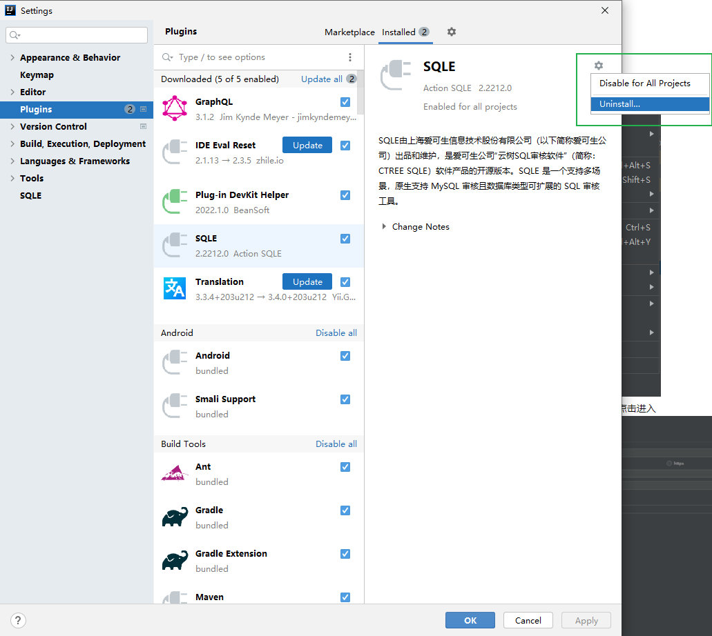

# SQLE-Jetbrains-Plugin

## 简介

该项目是[SQLE](https://github.com/actiontech/sqle)
的 [IDEA 审核插件](https://github.com/actiontech/sqle-jetbrains-plugin) ,
该插件满足开发人员在开发阶段进行实时自助式的静态SQL审核，实现开发阶段审核上线等各个SQL开发阶段的SQL开发规范。

## 编译

JDK版本11,Gradle版本6.7.1

## 使用方式

### 下载地址

[插件下载地址](https://github.com/actiontech/sqle-jetbrains-plugin/releases)

### 安装插件

1. 点击 [File] - [settings] - [Plugins] 安装

### 升级插件

1. 在 [File] - [settings] - [Plugins] 中卸载旧版插件
   

### 配置插件
1. 点击 [File] - [Settings] 进入设置界面,点击左侧菜单最下方[SQLE], 填写SQLE环境信息, 点击 [OK] 保存

2. 配置参数说明

| 配置项             | 配置项说明                                            |
|-----------------|--------------------------------------------------|
| SQLE Addr       | SQLE 服务地址, 格式为 IP:Port                           |
| http/https按钮    | 指定通过http的方式连接SQLE还是通过https的方式连接                  |
| UserName        | 登录SQLE使用的用户名                                     |
| Password        | 登录SQLE使用的密码                                      |
| Test Connection | 测试连接是否成功, 将会尝试登录                                 |
| Project         | 项目名称                                             |
| DB Type         | 当其他配置正确时此下拉框会自动获取支持审核的实例类型, 选择后会使用此实例类型的审核规则进行审核 |
| Data Source     | 数据源名称                                            |
| Schema          | 数据库名称                                            |

###使用插件
1. 选中需要审核的SQL, 可以同时选中多条SQL.点击右键, 选中 [SQLE] - [Audit] , 也可以使用快捷键 [Ctrl] + [Shift] + [H], 插件会以弹窗的形式将审核结果进行展示

2. 审核mybatis xml文件,选中mybatis xml文件,鼠标右击点击 MyBatis Audit

3. 审核sql文件,选中sql文件,鼠标右击点击 SQL file Audit

4. 审核结果解读

## 常见问题解答

#### 1. 为什么插件配置项中的 [DB Type] 点击时偶尔会卡一下

答: 这是因为点击下拉框时下拉框会连接SQLE获取支持的实例类型, 这个过程可能会出现网络延迟

#### 2. SQLE在审核时使用的规则模板是什么

答: SQLE会根据设置中指定的数据库类型, 选择对应类型的默认模板进行审核, 且只会使用默认模板中的静态审核规则

#### 3. 我没有SQLE环境可以使用这个插件吗

答: SQLE有演示环境,如果只是想尝试一下这个插件可以连接 [演示环境](https://actiontech.github.io/sqle-docs-cn/0.overview/1_online_demo.html)

#### 插件支持哪些IDE

答: Jetbrains家的所有软件都是支持的
